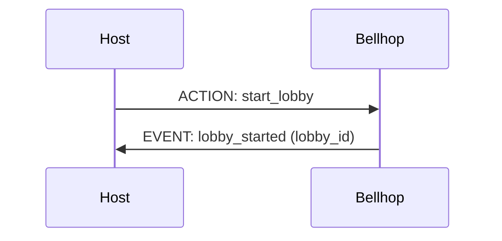
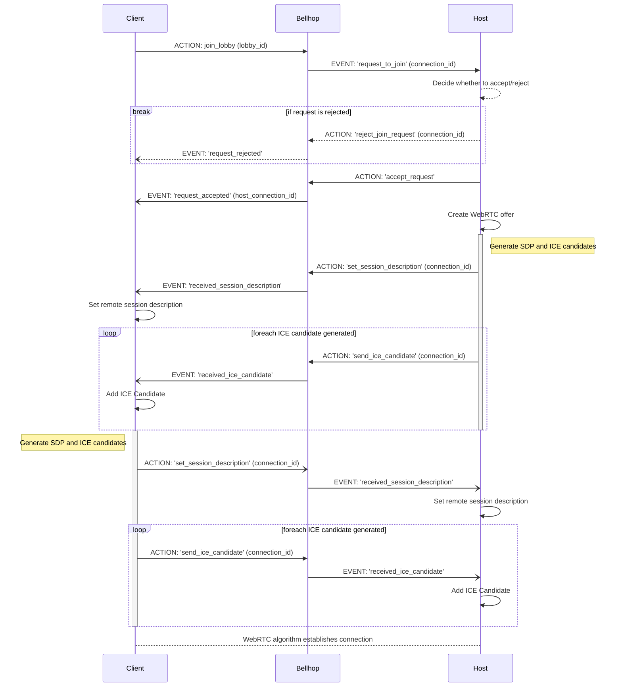

<p align="center">
  
</p>

**Bellhop** is a serverless WebSocket API for managing P2P game lobbies - it acts as a WebRTC signalling server, allowing players to exchange SDP messages and ICE candidates to establish direct connections with one another.

### Contents

- [Architecture & Deployment](#architecture--deployment)
- [Local Development & Testing](#local-development--testing)
- [Implementation](#implementation)

## Architecture & Deployment

Bellhop's infrastructure is managed using Terraform and deployed to AWS.


- **Websocket API Gateway** provides the API and integrations with AWS Lambda.
- **AWS Lambda** handles the core logic.
- **DynamoDB** is used to store the currently open connections and lobbies.

## Local Development & Testing

A [localstack](https://www.localstack.cloud) container is used to emulate portions of the stack for testing and local development.

- `docker compose up localstack-setup` will spin up the `localstack` and `localstack-setup` containers. The `setup` container uses the [tflocal wrapper script](https://docs.localstack.cloud/user-guide/integrations/terraform/#tflocal-wrapper-script) to spin up a subset of the AWS services which can be tested against.
- `docker compose run bellhop bash` will shell into a container containing the `bellhop` source code. You can then open a python terminal and run code against the local `dynamodb` instance, for example:
  ```py
  >>> from core import services, actions
  >>> from tests import utils
  >>> dynamo = services.get_db()
  >>> dynamo.list_tables()["TableNames"]
  ['WebsocketConnections']
  >>> actions.add_connection("some-connection-id")
  >>> utils.get_all_dynamo_items(dynamo)
  [{'connectionId': {'S': 'some-connection-id'}}]
  ```
- `docker compose run bellhop pytest` will run the automated tests against the localstack.

## Implementation

The following section describes the basic principles behind Bellhop's implementation and how it can be used in practice.

### Actions & Events

Bellhop messages can be partitioned into _actions_ and _events_:

- **Actions** are requests from a client to Bellhop to do something("start a lobby", "request to join a lobby", etc).
  ```json
  {
    "action": "name_of_action",
    "content": {
      // depends on the action
      "key": "value",
    }
  }
  ```
- **Events** are bellhop's response to an action (e.g. "lobby started").
  ```json
  {
    "event": "name_of_event",
    "content": {
      // depends on the action
      "key": "value",
    }
  }
  ```

### Starting a Lobby

Starting a lobby is a simple process, consisting of only one action.



### Joining a Lobby

Joining a lobby is much more complicated, because it involves exchanging messages and candidates in order to bypass the signalling server and establish a direct WebRTC connection between two peers.


