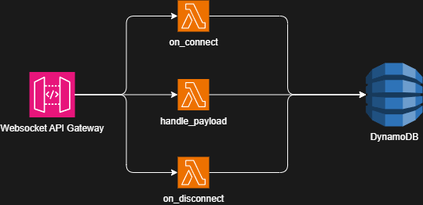

# BellHop

⚠️ UNDER CONSTRUCTION ⚠️

A serverless websocket signalling API for managing game lobbies. BellHop is intended to be used to allow players to establish connections via WebRTC.

## Architecture

BellHop is managed using Terraform and deployed to AWS. The architecture is entirely serverless.



## Local Development / Testing

A [localstack](https://www.localstack.cloud) container is used to emulate portions of the stack for testing and local development.

- `docker compose up localstack-setup` will spin up the `localstack` and `localstack-setup` containers. The `setup` container uses the [tflocal wrapper script](https://docs.localstack.cloud/user-guide/integrations/terraform/#tflocal-wrapper-script) to spin up a subset of the AWS services which can be tested against.
- `docker compose run bellhop bash` will shell into a container containing the `bellhop` source code. You can then open a python terminal and run code against the local `dynamodb` instance, for example:
  ```py
  >>> from utils import connections, db
  >>> dynamo = db.get_db()
  >>> dynamo.list_tables()["TableNames"]
  ['WebsocketConnections']
  ```

In future this could be used to set up automated tests, but right now it mainly serves as a means for manual testing.
